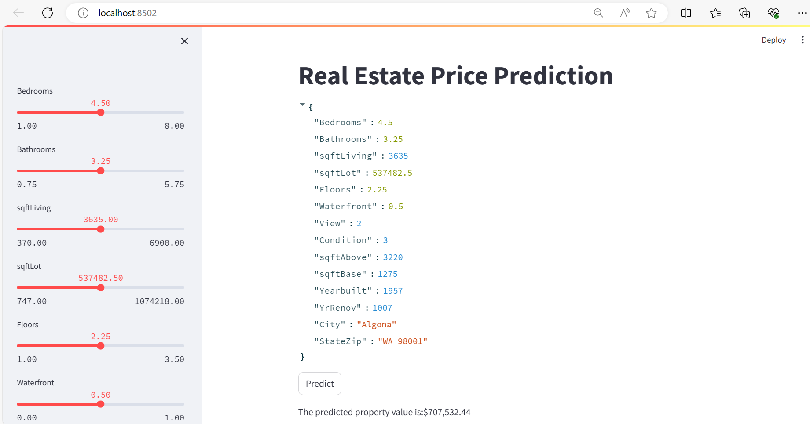

# regression_project

## Overview
This project focuses on building a system to predict property prices based on various attributes such as the number of bedrooms, bathrooms, floors, and the city. The system involves data normalization, preprocessing, model training, optimization, and deployment as a user-friendly Streamlit application.

## Key Features

### 1. Normalizing Data
- Created a normalized database from the raw data file.
- Loaded the normalized data into SQLite3 for efficient data storage and retrieval.

### 2. Data Preprocessing
- Removed unwanted data and handled missing values using imputation techniques.
- Generated a profile report for training data analysis.
- Applied one-hot encoding for categorical variables.
- Used `seaborn` and `matplotlib` for visualizing data insights through plots.

### 3. Model Training and Optimization
- Trained and evaluated multiple models, including:
  - Linear Regression
  - Ridge Regression
  - Lasso Regression
  - Decision Tree
  - Random Forest
- Registered all experiments and models in MLFlow on Dagshub.
- Performed Principal Component Analysis (PCA) to generate new features for improving model performance.

### 4. Model Deployment
- Selected the best-performing model.
- Created a Docker image for deployment.
- Deployed the model on DigitalOcean.

### 5. Streamlit App
- Developed a user-friendly Streamlit application that interfaces with the deployed model.
- The app allows users to input property details and predict property prices in real time.

## Skills and Tools
- **Programming**: Python
- **Database**: SQLite3
- **Data Analysis**: Pandas, Seaborn, Matplotlib
- **Model Management**: MLFlow, Dagshub
- **Deployment**: Docker, DigitalOcean
- **User Interface**: Streamlit
- **Version Control**: GitHub

